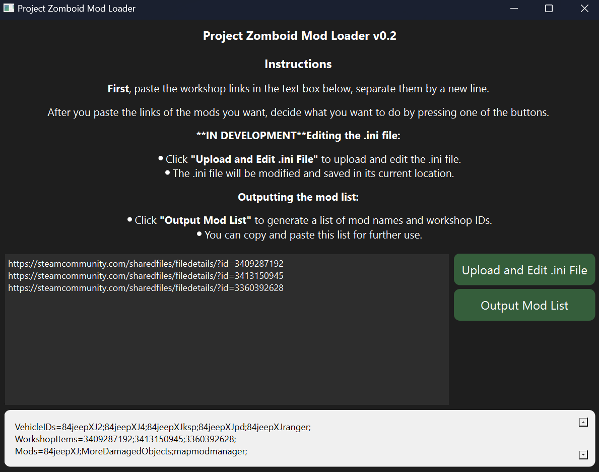

# Project Zomboid Mod Loader

---

## Important Notes

This project is still in the early stages of development. The GUI is not yet implemented and the logic is still being worked on. I created this because I wanted to automate the process of adding mods to the `server.ini` file for Project Zomboid. I will be updating this project as I work on it. The code currently lives in 1 file (`main.py`) and is not yet organized into separate files. I will be working on that as well.

### TODO

#### Must Do
[ / ] Add support for scraping vehicle ids
[ ] Remove unused packages
[ ] Deadwood the codebase
[ / ] Output mod names (Done)
[ ]  Edit the .ini file directly, copy the existing file, append "backup" to the name and drop the new file in the same location
[ ] Error handling for duplicate links
[ ] Error handling for invalid links
[ ] Error handling for invalid entries
[ ] Error handling for empty entries

#### Should Have

- [ ] Make it easier to paste multiple links
- [ ] Highlight the links that are invalid
- [ ] Highlight the links that are duplicates
- [ ] Highlight the links that are empty

#### Could Have

- [ ] A way to look up mods using the steam api
- [ ] A way to add the mods by clicking a button next to the mod in the list

#### Won't Have

- [ ] placeholder

---

## How to Launch

### **Instructions to Clone, Build, and Run the Project**

Follow these steps to **pull your repository, install dependencies, and run the application**.

#### **1. Clone the Repository**
Open a terminal (Command Prompt, PowerShell, or macOS/Linux terminal) and run:

```bash
git clone git@github.com:choushen/pz-server-mod-manager.git
```
This will create a folder named `pz-server-mod-manager`.

#### **2. Navigate into the Project Directory**
```bash
cd pz-server-mod-manager
```

#### **3. Create a Virtual Environment (Recommended)**
To isolate dependencies, create a virtual environment:

##### **Windows (PowerShell)**
```powershell
python -m venv venv
venv\Scripts\activate
```

##### **macOS/Linux**
```bash
python3 -m venv venv
source venv/bin/activate
```

#### **4. Install Dependencies**
Ensure you have all required packages installed:

```bash
pip install -r requirements.txt
```

If `requirements.txt` doesn’t exist, install manually:

```bash
pip install requests requests-html lxml PySide6
```

#### **5. Run the Application**
Execute the main script:

```bash
python main.py
```

---

## How to Use

<p><b>First</b>, paste the workshop links in the text box below, separate them by a new line.</p>
<p>After you paste the links of the mods you want, decide what you want to do by pressing one of the buttons.</p>

<p><b>**IN DEVELOPMENT**Editing the .ini file:</b></p>
<ul>
    <li>Click <b>"Upload and Edit .ini File"</b> to upload and edit the .ini file.</li>
    <li>The .ini file will be modified and saved in its current location.</li>
</ul>

<p><b>Outputting the mod list:</b></p>
<ul>
    <li>Click <b>"Output Mod List"</b> to generate a list of mod names and workshop IDs.</li>
    <li>You can copy and paste this list for further use.</li>
</ul>



---

## How it works (Logic)

### Step 1

- textbox to paste workshop links

- scrape workshop link for:  

```xpath
//div[text()='Mod ID: ModManager']
//div[text()='Workshop ID: 2694448564']
```

### Step 2

Parse the returned data and extract the Mod ID and Workshop ID from the HTML and then add them to two separate lists. One for Mod IDs and one for Workshop IDs.

### Step 3

Read the selected *.ini file, find the following lines:

```ini
Mods=Name1l;Name2;Name3;
WorkshopItems=123456;789101112;
```

Append the list of Mod IDs to the `Mods` line and the list of Workshop IDs to the `WorkshopItems` line.

## GUI Layout

- Textbox for pasting workshop links
- Button to start the process
- File upload button to select the *.ini file
- Textbox to display the output
- Progress bar to show the progress of the process
